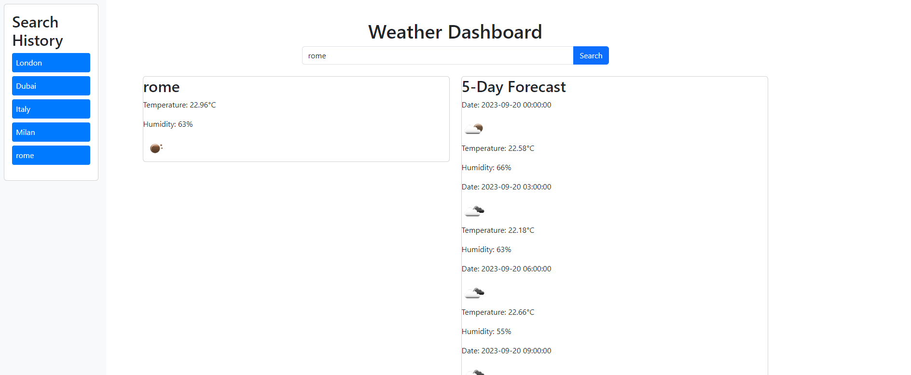

# Weather_Dashboard_using_API
Using the 5 Day Weather Forecast API to retrieve weather data in cities for my weather dashboard

Weather Dashboard is a simple web application that allows users to search for the current weather and a 5-day forecast for a specific city. It provides real-time weather information using data from the OpenWeatherMap API.

**Live Demo:** [Weather Dashboard](https://b70b70.github.io/Weather_Dashboard_using_API/)

## Features

- **Search by Location:** Enter the name of any city/country and click the "Search" button to fetch weather data.

- **Current Weather:** Display the current temperature, humidity, and an icon representing the weather condition.

- **5-Day Forecast:** View a 5-day forecast that includes date, temperature, humidity, and weather icons.

- **Search History:** Keep track of your recent searches for easy access to weather information.

## Usage

- Enter the name of a city/country in the search input field and click the "Search" button.

- The current weather and 5-day forecast for the specified location will be displayed.

- Click on a city in the search history to quickly fetch weather data for that location again.

## Technologies Used

- HTML5
- CSS (with Bootstrap for styling)
- JavaScript (including Day.js for date handling)
- OpenWeatherMap API

This effort was made by Faheem Ali.
